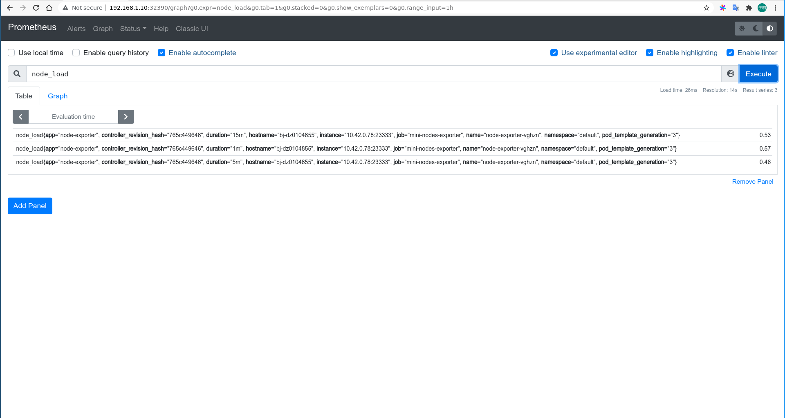
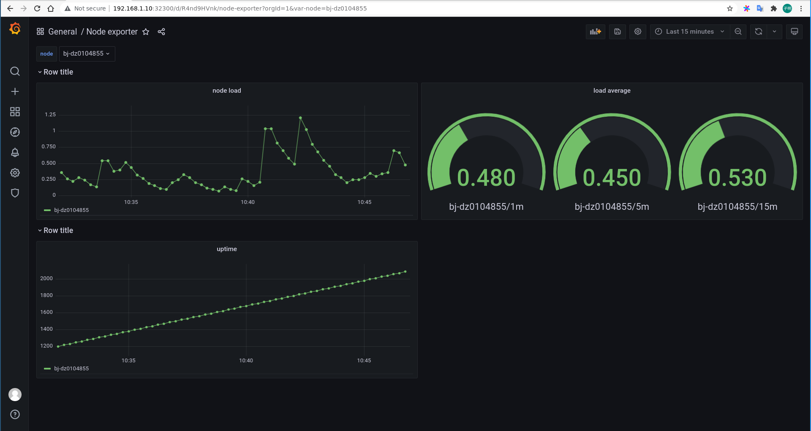

# mini-node-exporter

mini-node-exporter is a project as the interview
for [mentorship program of Chaos Mesh on LFX Mentorship 2021 fall](https://mentorship.lfx.linuxfoundation.org/project/8db683b0-0273-4a83-9ed9-4c33ee2cfcf0).

## Overview

This project implements the following features:

1. Build a web application that exposes several metrics.
2. Collect and make a dashboard for the exposed metrics.
3. Orchestrate this monitoring stack on kubernetes.

## Requirements

1. Golang v1.11+
2. Docker (optional)
3. Kubernetes (optional)

## Quick start

You can deploy only `mini-node-exporter` or the entire monitor stack on kubernetes.

### Build on localhost

To build binary locally, simply with Makefile:

```bash
make
```

And a binary named `node-exporter` will be built in `./bin`. <br>
Or you can run it with Docker:

```bash
$ sudo docker run --rm --network host firgavin/mini-node-exporter:v6
```

mini-node-exporter will listen on `0.0.0.0:23333`, and expose several endpoints:

- `/info/hostname` shows the hostname with plain text
- `/info/uptime` shows the uptime of the system in seconds with plain text
- `/info/load` shows the load average in 1m, 5m and 15m with JSON, example `{"1m": 0.57, "5m":0.80, "15m":0.77}`
- `/metrics` exposes metrics that could be scraped by prometheus
    - `node_load`: load average, with a label for three duration
    - `node_uptime`: uptime of the system in seconds

Then you can deploy Prometheus and Grafana on localhost to collect node information.

### Build on kubernetes

You can also build all of this on Kubernetes. Make sure your `kubeconfig` has enough authority. The monitoring stack
is orchestrated as follows:

1. daemonSet for` mini-node-exporter`
2. deployment with 1 replica for `prometheus` and `grafana`
3. `prometheus` collect all exporter pods with specify annotations and labels
4. module communicates each others through `service`

Apply manifests:

```bash
$ kubectl apply -k manifests
```

Example output:

```bash
serviceaccount/prometheus unchanged
Warning: rbac.authorization.k8s.io/v1beta1 ClusterRole is deprecated in v1.17+, unavailable in v1.22+; use rbac.authorization.k8s.io/v1 ClusterRole
clusterrole.rbac.authorization.k8s.io/prometheus unchanged
Warning: rbac.authorization.k8s.io/v1beta1 ClusterRoleBinding is deprecated in v1.17+, unavailable in v1.22+; use rbac.authorization.k8s.io/v1 ClusterRoleBinding
clusterrolebinding.rbac.authorization.k8s.io/prometheus unchanged
configmap/grafana-dashboard-gd29k862kg unchanged
configmap/grafana-datasource unchanged
configmap/prometheus-grafana unchanged
service/grafana unchanged
service/node-exporter unchanged
service/prometheus unchanged
deployment.apps/grafana unchanged
deployment.apps/prometheus unchanged
daemonset.apps/node-exporter unchanged

```

**Note:**

I use `NodePort` on each service for efficient debugging. This may not be scientific. Then list services to get
endpoints:

```bash
$ kubectl get svc           
NAME            TYPE        CLUSTER-IP     EXTERNAL-IP   PORT(S)           AGE
kubernetes      ClusterIP   10.43.0.1      <none>        443/TCP           22h
grafana         NodePort    10.43.142.87   <none>        3000:32300/TCP    12h
node-exporter   NodePort    10.43.149.18   <none>        23333:32333/TCP   12h
prometheus      NodePort    10.43.209.1    <none>        9090:32390/TCP    12h

```

Access Prometheus and Grafana on web browser:





## References

- https://prometheus.io/docs/prometheus/latest/getting_started/
- https://prometheus.io/docs/prometheus/latest/configuration/configuration/
- https://prometheus.io/docs/instrumenting/clientlibs/
- https://man7.org/linux/man-pages/man5/proc.5.html
- https://kubernetes.io/docs/concepts/workloads/controllers/daemonset/
- https://kubernetes.io/docs/concepts/services-networking/service/

